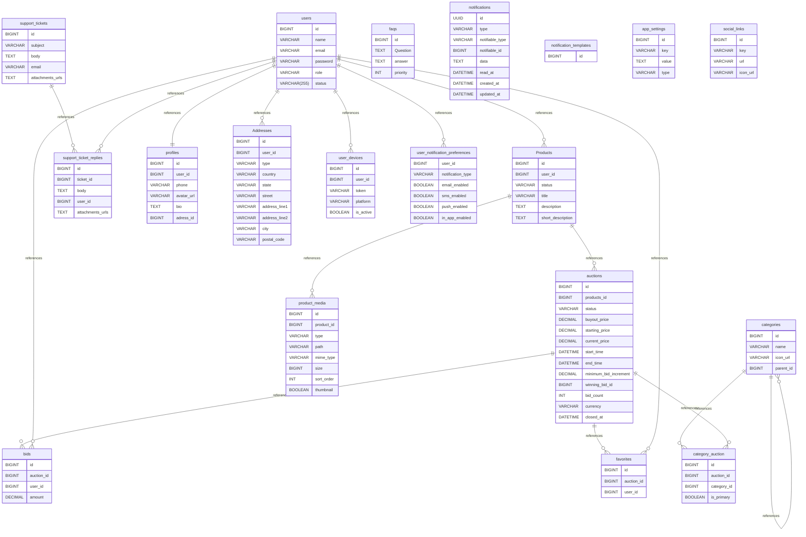

# mazab-api
# Mazad — Auction Marketplace Backend

Mazad is a marketplace and auction platform backend built with Laravel.

The system is designed to support product listings, timed auctions, real-time bidding, user management, notifications, media storage, and administrative management.

This project is also being developed as a practical backend and system-design project, with a focus on clean architecture, database integrity, security, concurrency, observability, and scalability.

> 🚧 The project is currently under active development.

---

## Overview

Mazad allows users to:

- Create and manage product listings
- Upload product images and videos
- Submit products for admin approval
- Schedule and manage auctions
- Participate in timed auctions
- Place bids
- Set a minimum bid increment
- Set a buyout price
- Follow/favorite auctions
- Receive notifications
- Contact customer support

Administrators can:

- Manage users
- Review and approve products
- Manage auctions
- Manage categories
- Manage application settings
- Manage FAQs
- Manage support tickets
- Manage notification settings
- Monitor platform activity

The backend provides both:

- REST API for the Flutter mobile application
- Web-based admin panel using Laravel + Inertia

---

# Architecture

The system follows a modular monolithic architecture.

```text
                         ┌──────────────────┐
                         │   Flutter App    │
                         │   Mobile Client  │
                         └────────┬─────────┘
                                  │
                                  │ REST API
                                  ▼
┌─────────────────────────────────────────────────────┐
│                  Mazad Backend                      │
│                                                     │
│  ┌─────────────────┐       ┌────────────────────┐   │
│  │  REST API       │       │  Admin Panel       │   │
│  │  for Flutter    │       │  Laravel + Inertia │   │
│  └────────┬────────┘       └─────────┬──────────┘   │
│           │                          │              │
│           └────────────┬─────────────┘              │
│                        │                            │
│                  Application Layer                  │
│                        │                            │
│          ┌─────────────┴─────────────┐              │
│          │                           │              │
│       Database                    Redis             │
│                                                     │
└─────────────────────────────────────────────────────┘
             │                         │
             ▼                         ▼
       Firebase                    Cloudflare R2
       ├── OTP                    ├── Images
       └── FCM                    └── Videos

       


- [Database Type](#database-type)
- [Table Structure](#table-structure)
	- [users](#users)
	- [profiles](#profiles)
	- [Addresses](#addresses)
	- [Products](#products)
	- [auctions](#auctions)
	- [bids](#bids)
	- [categories](#categories)
	- [category_auction](#category_auction)
	- [favorites](#favorites)
	- [support_tickets](#support_tickets)
	- [support_ticket_replies](#support_ticket_replies)
	- [faqs](#faqs)
	- [user_devices](#user_devices)
	- [notifications](#notifications)
	- [notification_templates](#notification_templates)
	- [user_notification_preferences](#user_notification_preferences)
	- [app_settings](#app_settings)
	- [social_links](#social_links)
	- [product_media](#product_media)
- [Relationships](#relationships)
- [Database Diagram](#database-diagram)

## Introduction

## Database type

- **Database system:** MariaDB
## Table structure

### users

| Name         | Type         | Settings    | References                                                                                                                                                                                                          | Note |
| ------------ | ------------ | ----------- | ------------------------------------------------------------------------------------------------------------------------------------------------------------------------------------------------------------------- | ---- |
| **id**       | BIGINT       | 🔑 PK, null | fk_users_id_profiles, fk_users_id_Products, fk_users_id_Addresses, fk_users_id_favorites, fk_users_id_bids, fk_users_id_user_devices, fk_users_id_user_notification_preferences, fk_users_id_support_ticket_replies |      |
| **name**     | VARCHAR      | null        |                                                                                                                                                                                                                     |      |
| **email**    | VARCHAR      | null        |                                                                                                                                                                                                                     |      |
| **password** | VARCHAR      | null        |                                                                                                                                                                                                                     |      |
| **role**     | VARCHAR      | null        |                                                                                                                                                                                                                     |      |
| **status**   | VARCHAR(255) | null        |                                                                                                                                                                                                                     |      | 


### profiles

| Name           | Type    | Settings    | References | Note |
| -------------- | ------- | ----------- | ---------- | ---- |
| **id**         | BIGINT  | 🔑 PK, null |            |      |
| **user_id**    | BIGINT  | null        |            |      |
| **phone**      | VARCHAR | null        |            |      |
| **avatar_url** | VARCHAR | null        |            |      |
| **bio**        | TEXT    | null        |            |      |
| **adress_id**  | BIGINT  | null        |            |      | 


### Addresses

| Name              | Type    | Settings    | References | Note |
| ----------------- | ------- | ----------- | ---------- | ---- |
| **id**            | BIGINT  | 🔑 PK, null |            |      |
| **user_id**       | BIGINT  | null        |            |      |
| **type**          | VARCHAR | null        |            |      |
| **country**       | VARCHAR | null        |            |      |
| **state**         | VARCHAR | null        |            |      |
| **street**        | VARCHAR | null        |            |      |
| **address_line1** | VARCHAR | null        |            |      |
| **address_line2** | VARCHAR | null        |            |      |
| **city**          | VARCHAR | null        |            |      |
| **postal_code**   | VARCHAR | null        |            |      | 


### Products

| Name                  | Type    | Settings    | References                                            | Note |
| --------------------- | ------- | ----------- | ----------------------------------------------------- | ---- |
| **id**                | BIGINT  | 🔑 PK, null | fk_Products_id_auctions, fk_Products_id_product_media |      |
| **user_id**           | BIGINT  | null        |                                                       |      |
| **status**            | VARCHAR | null        |                                                       |      |
| **title**             | VARCHAR | null        |                                                       |      |
| **description**       | TEXT    | null        |                                                       |      |
| **short_description** | TEXT    | null        |                                                       |      | 


### auctions

| Name                      | Type     | Settings    | References                                                                     | Note |
| ------------------------- | -------- | ----------- | ------------------------------------------------------------------------------ | ---- |
| **id**                    | BIGINT   | 🔑 PK, null | fk_auctions_id_bids, fk_auctions_id_favorites, fk_auctions_id_category_auction |      |
| **products_id**           | BIGINT   | null        |                                                                                |      |
| **status**                | VARCHAR  | null        |                                                                                |      |
| **buyout_price**          | DECIMAL  | null        |                                                                                |      |
| **starting_price**        | DECIMAL  | null        |                                                                                |      |
| **current_price**         | DECIMAL  | null        |                                                                                |      |
| **start_time**            | DATETIME | null        |                                                                                |      |
| **end_time**              | DATETIME | null        |                                                                                |      |
| **minimum_bid_increment** | DECIMAL  | null        |                                                                                |      |
| **winning_bid_id**        | BIGINT   | null        |                                                                                |      |
| **bid_count**             | INT      | null        |                                                                                |      |
| **currency**              | VARCHAR  | null        |                                                                                |      |
| **closed_at**             | DATETIME | null        |                                                                                |      | 


### bids

| Name           | Type    | Settings    | References | Note |
| -------------- | ------- | ----------- | ---------- | ---- |
| **id**         | BIGINT  | 🔑 PK, null |            |      |
| **auction_id** | BIGINT  | null        |            |      |
| **user_id**    | BIGINT  | null        |            |      |
| **amount**     | DECIMAL | null        |            |      | 


### categories

| Name          | Type    | Settings    | References                                                     | Note |
| ------------- | ------- | ----------- | -------------------------------------------------------------- | ---- |
| **id**        | BIGINT  | 🔑 PK, null | fk_categories_id_category_auction, fk_categories_id_categories |      |
| **name**      | VARCHAR | null        |                                                                |      |
| **icon_url**  | VARCHAR | null        |                                                                |      |
| **parent_id** | BIGINT  | null        |                                                                |      | 


### category_auction

| Name            | Type    | Settings    | References | Note |
| --------------- | ------- | ----------- | ---------- | ---- |
| **id**          | BIGINT  | 🔑 PK, null |            |      |
| **auction_id**  | BIGINT  | null        |            |      |
| **category_id** | BIGINT  | null        |            |      |
| **is_primary**  | BOOLEAN | null        |            |      | 


### favorites

| Name           | Type   | Settings    | References | Note |
| -------------- | ------ | ----------- | ---------- | ---- |
| **id**         | BIGINT | 🔑 PK, null |            |      |
| **auction_id** | BIGINT | null        |            |      |
| **user_id**    | BIGINT | null        |            |      | 


### support_tickets

| Name                 | Type    | Settings    | References                                   | Note |
| -------------------- | ------- | ----------- | -------------------------------------------- | ---- |
| **id**               | BIGINT  | 🔑 PK, null | fk_support_tickets_id_support_ticket_replies |      |
| **subject**          | VARCHAR | null        |                                              |      |
| **body**             | TEXT    | null        |                                              |      |
| **email**            | VARCHAR | null        |                                              |      |
| **attachments_urls** | TEXT    | null        |                                              |      | 


### support_ticket_replies

| Name                 | Type   | Settings    | References | Note |
| -------------------- | ------ | ----------- | ---------- | ---- |
| **id**               | BIGINT | 🔑 PK, null |            |      |
| **ticket_id**        | BIGINT | null        |            |      |
| **body**             | TEXT   | null        |            |      |
| **user_id**          | BIGINT | null        |            |      |
| **attachments_urls** | TEXT   | null        |            |      | 


### faqs

| Name         | Type   | Settings    | References | Note |
| ------------ | ------ | ----------- | ---------- | ---- |
| **id**       | BIGINT | 🔑 PK, null |            |      |
| **Question** | TEXT   | null        |            |      |
| **answer**   | TEXT   | null        |            |      |
| **priority** | INT    | null        |            |      | 


### user_devices

| Name          | Type    | Settings    | References | Note |
| ------------- | ------- | ----------- | ---------- | ---- |
| **id**        | BIGINT  | 🔑 PK, null |            |      |
| **user_id**   | BIGINT  | null        |            |      |
| **token**     | VARCHAR | null        |            |      |
| **platform**  | VARCHAR | null        |            |      |
| **is_active** | BOOLEAN | null        |            |      | 


### notifications

| Name                | Type     | Settings    | References | Note |
| ------------------- | -------- | ----------- | ---------- | ---- |
| **id**              | UUID     | 🔑 PK, null |            |      |
| **type**            | VARCHAR  | null        |            |      |
| **notifiable_type** | VARCHAR  | null        |            |      |
| **notifiable_id**   | BIGINT   | null        |            |      |
| **data**            | TEXT     | null        |            |      |
| **read_at**         | DATETIME | null        |            |      |
| **created_at**      | DATETIME | null        |            |      |
| **updated_at**      | DATETIME | null        |            |      | 


### notification_templates

| Name   | Type   | Settings    | References | Note |
| ------ | ------ | ----------- | ---------- | ---- |
| **id** | BIGINT | 🔑 PK, null |            |      | 


### user_notification_preferences

| Name                  | Type    | Settings | References | Note |
| --------------------- | ------- | -------- | ---------- | ---- |
| **user_id**           | BIGINT  | null     |            |      |
| **notification_type** | VARCHAR | null     |            |      |
| **email_enabled**     | BOOLEAN | null     |            |      |
| **sms_enabled**       | BOOLEAN | null     |            |      |
| **push_enabled**      | BOOLEAN | null     |            |      |
| **in_app_enabled**    | BOOLEAN | null     |            |      | 


### app_settings

| Name      | Type    | Settings    | References | Note |
| --------- | ------- | ----------- | ---------- | ---- |
| **id**    | BIGINT  | 🔑 PK, null |            |      |
| **key**   | VARCHAR | null        |            |      |
| **value** | TEXT    | null        |            |      |
| **type**  | VARCHAR | null        |            |      | 


### social_links

| Name         | Type    | Settings    | References | Note |
| ------------ | ------- | ----------- | ---------- | ---- |
| **id**       | BIGINT  | 🔑 PK, null |            |      |
| **key**      | VARCHAR | null        |            |      |
| **url**      | VARCHAR | null        |            |      |
| **icon_url** | VARCHAR | null        |            |      | 


### product_media

| Name           | Type    | Settings    | References | Note |
| -------------- | ------- | ----------- | ---------- | ---- |
| **id**         | BIGINT  | 🔑 PK, null |            |      |
| **product_id** | BIGINT  | null        |            |      |
| **type**       | VARCHAR | null        |            |      |
| **path**       | VARCHAR | null        |            |      |
| **mime_type**  | VARCHAR | null        |            |      |
| **size**       | BIGINT  | null        |            |      |
| **sort_order** | INT     | null        |            |      |
| **thumbnail**  | BOOLEAN | null        |            |      | 


## Relationships

- **Products to auctions**: one_to_many
- **Products to product_media**: one_to_many
- **auctions to bids**: one_to_many
- **auctions to favorites**: one_to_many
- **categories to category_auction**: one_to_many
- **categories to categories**: one_to_many
- **support_tickets to support_ticket_replies**: one_to_many
- **users to profiles**: one_to_one
- **users to Products**: one_to_many
- **users to Addresses**: one_to_many
- **users to favorites**: one_to_many
- **users to bids**: one_to_many
- **users to user_devices**: one_to_many
- **users to user_notification_preferences**: one_to_many
- **users to support_ticket_replies**: one_to_many
- **auctions to category_auction**: one_to_many

## Database Diagram

